# 🕷️ 크롤링 엔진 고도화 프로젝트 (CradCrawl Advanced)

[](https://www.python.org)
[](LICENSE)
[](https://github.com/EnzoMH/cradcrawl_adv)

> 🚀 **모듈화된 고성능 크롤링 시스템**  
> AI 기반 데이터 추출 및 검증 기능을 갖춘 차세대 크롤링 엔진

## 📋 목차

- [개요](#개요)
- [주요 기능](#주요-기능)
- [시스템 아키텍처](#시스템-아키텍처)
- [설치 및 설정](#설치-및-설정)
- [사용 방법](#사용-방법)
- [모듈 구조](#모듈-구조)
- [성능 최적화](#성능-최적화)
- [문제 해결](#문제-해결)
- [기여 방법](#기여-방법)

## 🎯 개요

이 프로젝트는 [CradCrawl Advanced](https://github.com/EnzoMH/cradcrawl_adv)의 크롤링 엔진 고도화 작업의 일환으로 개발된 **모듈화된 고성능 크롤링 시스템**입니다.

### 주요 특징

- 🤖 **AI 기반 데이터 추출**: Google Gemini API를 활용한 지능형 콘텐츠 분석
- ⚡ **고성능 병렬 처리**: 동적 워커 관리 및 자원 최적화
- 🔍 **다중 검색 엔진**: Google 검색 + 직접 홈페이지 크롤링
- 📊 **실시간 모니터링**: 시스템 리소스 및 성능 추적
- 🛡️ **견고한 검증**: 다단계 데이터 검증 및 품질 관리
- 📈 **동적 성능 조정**: 실시간 리소스 상태에 따른 자동 최적화

## 🚀 주요 기능

### 1. 모듈화된 아키텍처

```
📦 크롤링 엔진
├── 🧠 AI 모델 관리자 (Gemini API)
├── 👥 워커 관리자 (멀티스레딩)
├── 🔍 구글 검색 엔진
├── 🌐 홈페이지 크롤러
├── 📞 전화번호 검증기
├── 📊 데이터 매퍼
├── 💾 엑셀 프로세서
├── 🛡️ 검증 엔진
└── 📈 성능 관리자
```

### 2. 지원 기관 유형

- 🎓 **학원** (academy)
- 🏢 **주민센터** (community_center)
- ⛪ **교회** (church)
- 🏥 **기타 기관** (확장 가능)

### 3. 데이터 처리 파이프라인

```mermaid
graph LR
    A[엑셀 파일] --> B[데이터 매핑]
    B --> C[전처리]
    C --> D[구글 검색]
    D --> E[홈페이지 크롤링]
    E --> F[AI 분석]
    F --> G[데이터 검증]
    G --> H[결과 저장]
```



## 🏗️ 시스템 아키텍처

### 핵심 컴포넌트

| 컴포넌트               | 파일                            | 크기  | 역할                     |
| ---------------------- | ------------------------------- | ----- | ------------------------ |
| 🎯 **메인 크롤러**     | `main_crawler.py`               | 324줄 | 시스템 통합 및 실행 관리 |
| 🕷️ **크롤링 엔진**     | `utils/crawling_engine.py`      | 26KB  | 핵심 크롤링 로직         |
| 🗺️ **데이터 매퍼**     | `utils/data_mapper.py`          | 21KB  | 데이터 변환 및 매핑      |
| 🛡️ **검증 엔진**       | `utils/verification_engine.py`  | 18KB  | 데이터 품질 검증         |
| 📊 **엑셀 프로세서**   | `utils/excel_processor.py`      | 17KB  | 엑셀 파일 처리           |
| 📞 **전화번호 검증**   | `utils/phone_validator.py`      | 15KB  | 전화번호 형식 검증       |
| 🌐 **홈페이지 크롤러** | `utils/homepage_crawler.py`     | 14KB  | 웹사이트 크롤링          |
| 🔍 **구글 검색**       | `utils/google_search_engine.py` | 13KB  | 구글 검색 자동화         |
| 📄 **정보 추출기**     | `utils/info_extractor.py`       | 12KB  | 콘텐츠 정보 추출         |
| 👥 **워커 관리자**     | `utils/worker_manager.py`       | 11KB  | 멀티스레딩 관리          |
| 📈 **시스템 분석**     | `utils/system_analyzer.py`      | 10KB  | 시스템 리소스 분석       |
| 🤖 **AI 모델 관리**    | `utils/ai_model_manager.py`     | 7.2KB | Gemini API 관리          |
| 🔧 **데이터 처리**     | `utils/data_processor.py`       | 7.3KB | 데이터 전처리            |
| 📊 **시스템 모니터**   | `utils/system_monitor.py`       | 6.6KB | 실시간 모니터링          |
| 🌐 **웹드라이버 관리** | `utils/web_driver_manager.py`   | 4.4KB | Selenium 관리            |
| 🔢 **상수 정의**       | `utils/constants.py`            | 1.2KB | 공통 상수                |

## 🛠️ 설치 및 설정

### 1. 시스템 요구사항

```bash
# Python 버전
Python 3.8+

# 최소 하드웨어 요구사항
- RAM: 4GB 이상 (8GB 권장)
- 디스크: 2GB 이상 여유 공간
- CPU: 2코어 이상 (4코어 권장)
```

### 2. 의존성 설치

```bash
# 기본 의존성
pip install -r requirements.txt

# 주요 패키지
pip install selenium beautifulsoup4 pandas google-generativeai
pip install openpyxl python-dotenv psutil undetected-chromedriver
```

### 3. 환경 변수 설정

```bash
# .env 파일 생성
GEMINI_API_KEY=your_gemini_api_key_here
CHROME_DRIVER_PATH=./chromedriver
MAX_WORKERS=4
BATCH_SIZE=10
```

### 4. Chrome 드라이버 설정

```bash
# 자동 설치 (권장)
python -c "from utils.web_driver_manager import WebDriverManager; WebDriverManager().setup_driver()"

# 또는 수동 설치
# https://chromedriver.chromium.org/downloads
```

## 🎮 사용 방법

### 1. 기본 사용법

```bash
# 학원 크롤링
python main_crawler.py data/academy.xlsx academy

# 주민센터 크롤링
python main_crawler.py data/community_center.xlsx community_center

# 교회 크롤링
python main_crawler.py data/church.xlsx church
```

### 2. 성능 테스트

```bash
# 시스템 성능 테스트
python main_crawler.py --test

# 출력 예시:
# 🧪 성능 테스트 시작
# 📊 시스템 리소스: CPU 25.3%, 메모리 68.2%
# 🤖 AI 모델 상태: Gemini API 연결됨
# ⚙️ 최대 워커 수: 4개
# ✅ 성능 테스트 완료
```

### 3. 설정 옵션

```python
# config/performance_profiles.py
class PerformanceProfile:
    def __init__(self):
        self.max_workers = 4        # 최대 워커 수
        self.batch_size = 10        # 배치 크기
        self.crawling_delay = 2.0   # 크롤링 지연 시간
        self.memory_threshold = 80  # 메모리 임계값 (%)
        self.cpu_threshold = 70     # CPU 임계값 (%)
```

## 📁 모듈 구조

### 핵심 모듈 상세

#### 🎯 MainCrawler (`main_crawler.py`)

```python
class MainCrawler:
    """메인 크롤링 애플리케이션"""

    def __init__(self):
        # 모든 서브시스템 통합 관리
        self.performance_manager = PerformanceManager()
        self.ai_model_manager = AIModelManager()
        self.crawling_engine = CrawlingEngine()
        # ... 기타 모듈들

    def run_crawling(self, excel_path, institution_type):
        """크롤링 실행 메인 로직"""
        # 1. 시스템 정보 출력
        # 2. 엑셀 파일 로드
        # 3. 데이터 매핑
        # 4. 크롤링 실행
        # 5. 결과 검증
        # 6. 결과 저장
```

#### 🕷️ CrawlingEngine (`utils/crawling_engine.py`)

```python
class CrawlingEngine:
    """핵심 크롤링 로직"""

    def process_institutions(self, df, institution_type):
        """기관 데이터 처리"""
        # 멀티스레딩 기반 병렬 처리
        # AI 모델 활용 데이터 추출
        # 실시간 성능 모니터링
        pass

    def extract_institution_info(self, search_query):
        """기관 정보 추출"""
        # 구글 검색 -> 홈페이지 크롤링 -> AI 분석
        pass
```

#### 🤖 AIModelManager (`utils/ai_model_manager.py`)

```python
class AIModelManager:
    """AI 모델 관리"""

    def extract_with_gemini(self, text_content, prompt_template):
        """Gemini API를 활용한 정보 추출"""
        # 프롬프트 최적화
        # API 호출 관리
        # 결과 후처리
        pass

    def validate_extraction_result(self, result):
        """추출 결과 검증"""
        pass
```

#### 👥 WorkerManager (`utils/worker_manager.py`)

```python
class WorkerManager:
    """워커 스레드 관리"""

    def create_worker_pool(self, max_workers):
        """워커 풀 생성"""
        pass

    def distribute_tasks(self, tasks, workers):
        """작업 분배"""
        pass

    def monitor_worker_health(self):
        """워커 상태 모니터링"""
        pass
```

## ⚡ 성능 최적화

### 1. 동적 성능 조정

```python
# 실시간 리소스 모니터링
current_resources = self.performance_manager.get_current_resources()

# 자동 성능 조정
if current_resources['memory_percent'] > 80:
    # 워커 수 감소
    self.worker_manager.reduce_workers()

if current_resources['cpu_percent'] < 30:
    # 워커 수 증가
    self.worker_manager.increase_workers()
```

### 2. 메모리 관리

```python
# 배치 처리로 메모리 사용량 제어
for batch in self.data_processor.create_batches(df, batch_size=100):
    results = self.process_batch(batch)
    self.save_intermediate_results(results)
    self.cleanup_memory()
```

### 3. 캐싱 전략

```python
# 검색 결과 캐싱
@lru_cache(maxsize=1000)
def cached_google_search(query):
    return self.google_search_engine.search(query)

# 웹드라이버 풀링
self.driver_pool = self.web_driver_manager.create_driver_pool(size=4)
```

## 📊 모니터링 및 로깅

### 1. 실시간 모니터링

```python
# 시스템 리소스 모니터링
📊 시스템 리소스: CPU 45.2%, 메모리 67.8%
👥 활성 워커: 4/4개
🕷️ 크롤링 진행률: 1,234/5,000 (24.7%)
⏱️ 평균 처리 시간: 2.3초/항목
```

### 2. 상세 로깅

```python
# 로그 레벨별 출력
INFO  - 📊 엑셀 파일 로드 완료: 5,000개 레코드
INFO  - 🕷️ 크롤링 엔진 시작...
DEBUG - 🔍 구글 검색 실행: "서울시 강남구 학원"
DEBUG - 🌐 홈페이지 접속: https://example.com
WARN  - ⚠️ 검색 결과 없음: 일부 항목 건너뛰기
ERROR - ❌ 크롤링 오류: 네트워크 연결 실패
```

## 🔧 문제 해결

### 자주 발생하는 문제들

#### 1. Chrome 드라이버 문제

```bash
# 문제: ChromeDriver 버전 불일치
# 해결: 자동 버전 감지 사용
from utils.web_driver_manager import WebDriverManager
driver_manager = WebDriverManager()
driver_manager.setup_driver(auto_detect_version=True)
```

#### 2. 메모리 부족

```bash
# 문제: 메모리 사용량 과다
# 해결: 배치 크기 조정
export BATCH_SIZE=5  # 기본값 10에서 5로 감소
export MAX_WORKERS=2  # 기본값 4에서 2로 감소
```

#### 3. API 할당량 초과

```bash
# 문제: Gemini API 할당량 초과
# 해결: 요청 간격 조정
export GEMINI_API_DELAY=2.0  # 2초 지연
export GEMINI_RETRY_COUNT=3  # 재시도 횟수
```

#### 4. 검색 결과 없음

```bash
# 문제: 구글 검색 결과 없음
# 해결: 검색 키워드 확장
- 기존: "학원명 전화번호"
- 개선: "학원명 연락처 주소 위치"
```

## 🧪 테스트 및 검증

### 1. 단위 테스트

```bash
# 개별 모듈 테스트
python -m pytest tests/test_phone_validator.py
python -m pytest tests/test_data_mapper.py
python -m pytest tests/test_ai_model_manager.py
```

### 2. 통합 테스트

```bash
# 전체 시스템 테스트
python main_crawler.py --test

# 특정 기관 유형 테스트
python main_crawler.py test_data/sample_academy.xlsx academy
```

### 3. 성능 벤치마크

```bash
# 성능 측정
python utils/system_analyzer.py --benchmark

# 결과 예시:
# 📊 벤치마크 결과:
# - 처리 속도: 250개/분
# - 메모리 사용량: 평균 512MB
# - CPU 사용률: 평균 45%
# - 성공률: 95.2%
```

## 🔄 업데이트 및 확장

### 1. 새로운 기관 유형 추가

```python
# utils/constants.py
INSTITUTION_TYPES = {
    'academy': '학원',
    'community_center': '주민센터',
    'church': '교회',
    'hospital': '병원',        # 새로 추가
    'pharmacy': '약국',        # 새로 추가
}

# utils/data_mapper.py
def map_hospital_columns(self, df):
    """병원 데이터 매핑"""
    return {
        'name': '병원명',
        'address': '주소',
        'phone': '대표전화',
        'speciality': '진료과목'
    }
```

### 2. 새로운 AI 모델 추가

```python
# utils/ai_model_manager.py
class AIModelManager:
    def __init__(self):
        self.gemini_model = self.setup_gemini()
        self.openai_model = self.setup_openai()      # 새로 추가
        self.claude_model = self.setup_claude()      # 새로 추가

    def extract_with_multiple_models(self, text, prompt):
        """다중 모델 앙상블"""
        results = []
        results.append(self.extract_with_gemini(text, prompt))
        results.append(self.extract_with_openai(text, prompt))
        return self.merge_results(results)
```

## 📈 로드맵

### 현재 버전 (v2.0)

- ✅ 모듈화된 아키텍처
- ✅ AI 기반 데이터 추출
- ✅ 동적 성능 조정
- ✅ 실시간 모니터링

### 다음 버전 (v2.1)

- 🔄 Redis 캐싱 시스템
- 🔄 분산 처리 지원
- 🔄 웹 UI 대시보드
- 🔄 실시간 알림 시스템

### 장기 계획 (v3.0)

- 🚀 Kubernetes 기반 배포
- 🚀 GraphQL API
- 🚀 머신러닝 기반 품질 예측
- 🚀 자동 A/B 테스팅

## 🤝 기여 방법

### 1. 개발 환경 설정

```bash
# 저장소 복제
git clone https://github.com/EnzoMH/cradcrawl_adv.git
cd cradcrawl_adv

# 개발 의존성 설치
pip install -r requirements-dev.txt

# 테스트 실행
python -m pytest tests/
```

### 2. 기여 가이드라인

- 🔀 **브랜치 전략**: feature/기능명 브랜치 사용
- 📝 **커밋 메시지**: 한국어 + 이모지 사용
- 🧪 **테스트**: 새로운 기능은 테스트 코드 필수
- 📚 **문서화**: 코드 변경 시 README 업데이트

### 3. 이슈 리포팅

```markdown
## 버그 리포트

- **환경**: Python 3.9, Windows 10
- **문제**: 크롤링 중 메모리 오류 발생
- **재현 방법**:
  1. 5000개 이상 데이터 로드
  2. 4개 워커로 크롤링 실행
  3. 30분 후 메모리 오류 발생
- **로그**: [로그 파일 첨부]
```

## 📞 지원 및 문의

- 🐛 **버그 리포트**: [GitHub Issues](https://github.com/EnzoMH/cradcrawl_adv/issues)
- 💬 **질문 및 토론**: [GitHub Discussions](https://github.com/EnzoMH/cradcrawl_adv/discussions)
- 📧 **이메일**: isfs003@gmail.com
- 📖 **문서**: [프로젝트 위키](https://github.com/EnzoMH/cradcrawl_adv/wiki)

---

## 📄 라이선스

이 프로젝트는 MIT 라이선스를 따릅니다. 자세한 내용은 [LICENSE](LICENSE) 파일을 참조하세요.

---

## 🙏 감사의 말

- **Google Gemini API**: AI 기반 콘텐츠 분석
- **Selenium**: 웹 브라우저 자동화
- **BeautifulSoup**: HTML 파싱
- **Pandas**: 데이터 처리
- **Python Community**: 오픈소스 생태계

---

<div align="center">
  <h3>🌟 이 프로젝트가 도움이 되셨다면 별표를 눌러주세요!</h3>
  <p>크롤링 엔진 고도화 프로젝트 © 2025</p>
</div>
